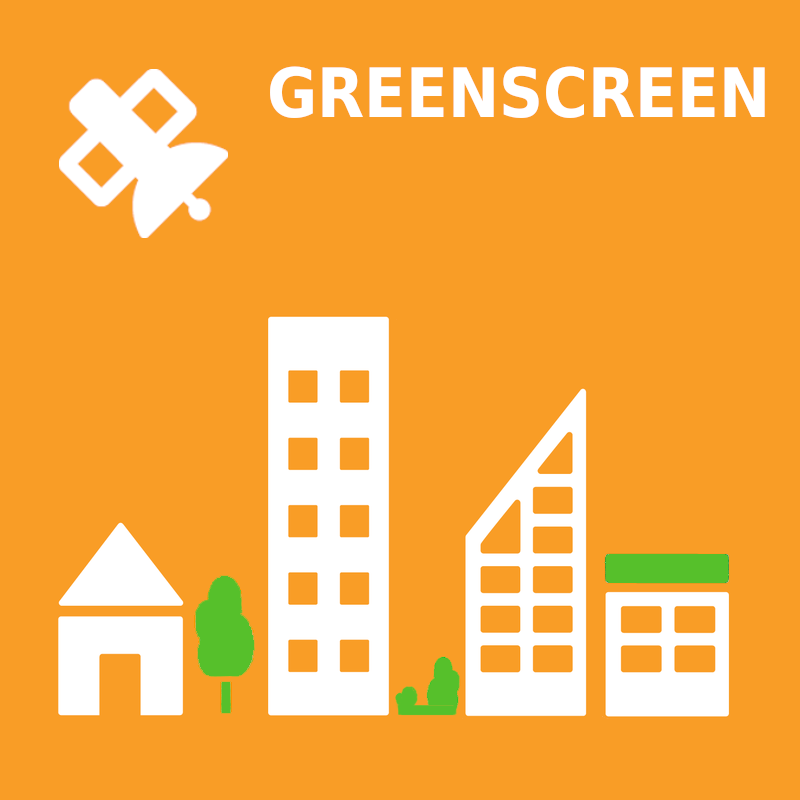

# GREENSCREEN - urban green areas development

This repository is a contribution to the [Amazon Sustainability Data Initiative (ASDI) Global Hackathon 2022](https://aws-asdi.devpost.com/?ref_feature=challenge&ref_medium=discover).

The idea is to support the UN Sustainable Development Goal Nr. 11 [Sustainable Cities and Communities](https://en.wikipedia.org/wiki/Sustainable_Development_Goal_11) by analyzing the development of urban green areas by the example of [Freising](https://www.openstreetmap.org/search?query=Freising#map=12/48.3899/11.7165) a small city near Munich, Germany.

 

## Try it out!
- check [http://greenscreen.sommergis.de/](http://greenscreen.sommergis.de/) for a working demo app
- install all Python packages from the requirements.txt `pip3 install -f requirements.txt`
- run the processing chain: change the city name to your city in `scripts/processing.py`
- change the city name in `src/app.py` and adjust the statistics loading
- run streamlit app with `streamlit run app.py`

## Project scope
The goal is to collect and analyze data on urban green spaces and visualize it in an appealing way with interactive maps and graphics so that the resulting information is easy to understand.
The methods and outcomes of this project shall be transferable to other cities. This is ensured by a high level of automation of the data processing and the usage of global avaliable datasets.
 

## Video

## Data & Methods 
The information shall be derived with the support of the following available datasets of ASDI:
- [ESA Worldcover 2020](https://registry.opendata.aws/esa-worldcover/)
- [Sentinel 1](https://registry.opendata.aws/sentinel-1/)
- [Sentinel 2 COGs](https://registry.opendata.aws/sentinel-2-l2a-cogs/)

Additional datasets:
- [GADM - Global Administrative Boundaries](https://gadm.org/data.html)
- [Openstreetmap](https://openstreetmap.org)

The following methods shall be evaluated regarding their application in the project:
- machine learning / deep learning based classification
- classic remote sensing analysis & statistial methods
- change detection
- development of a processing chain and a web app

### Time period
Data shall be analyzed since 2017 until 2022. As the city of Freising is located on the northern hemisphere in the moderate climate zone the start of june should be fine for detecting vegetation.

### Products
#### **Zonal statistics at GADM Level 3**
Aggregated statistical results shall be dervied at GADM Level 3 (communities) for each year. 

#### **Zonal statistics at real city boundary**
If applicable a more fine grained city boundary shall be created from the data. This finer boundary may be more valueable for insights because GADM Level 3 may contain the city itself with rural areas.

#### **Pixel level maps for each year**
Furthermore various maps at pixel level analysis shall be compiled that show the urban green area development for each year.

#### **Change detection pixel level maps**
Furthermore various maps at pixel level analysis shall be compiled that show the urban green area development for each year.

## Next Steps
- [x] create project logo (first draft)
- [x] create video (first draft)
- [x] checkout available resources on AWS
  - [x] SageMaker Labs account
  - [x] extra credits on AWS
- [x] evaluate data & methods
- [x] formulate technical road map
- [x] implementation phase
- [x] presentation (web page)
- [x] create final project logo 
- [ ] create final video

# GREENSCREEN - Entwicklung städtischer Grünflächen

Dieses Repository ist ein Beitrag zum Amazon Sustainability Data Initiative (ASDI) Global Hackathon 2022.

Die Idee ist, das UN-Nachhaltigkeitsziel Nr. 11 [Nachhaltige Städte und Gemeinden](https://en.wikipedia.org/wiki/Sustainable_Development_Goal_11) zu unterstützen, indem die Entwicklung von städtischen Grünflächen am Beispiel von [Freising](https://www.openstreetmap.org/search?query=Freising#map=12/48.3899/11.7165), einer Kleinstadt in der Nähe von München, analysiert wird.

 

## Projektumfang
Ziel ist es, Daten über städtische Grünflächen zu sammeln, zu analysieren und mit interaktiven Karten und Grafiken ansprechend zu visualisieren und damit die daraus resultierenden Informationen leicht verständlich aufzubereiten. Die Methoden und Ergebnisse dieses Projekts sollen auf andere Städte übertragbar sein. Dies wird durch einen hohen Automatisierungsgrad der Datenverarbeitung und die Nutzung global verfügbarer Datensätze gewährleistet.
 

## Video

## Daten und Methoden
Die Informationen sollen mit Hilfe der folgenden verfügbaren Datensätze von ASDI abgeleitet werden:
- [ESA Worldcover 2020](https://registry.opendata.aws/esa-worldcover/)
- [Sentinel 1](https://registry.opendata.aws/sentinel-1/)
- [Sentinel 2 COGs](https://registry.opendata.aws/sentinel-2-l2a-cogs/)

Zusätzliche Daten:
- [GADM - Global Administrative Boundaries](https://gadm.org/data.html)
- [Openstreetmap](https://openstreetmap.org)

Die folgenden Methoden sind auf ihre Verwendung zu bewerten:
- maschinelles Lernen / Deep Learning basierte Klassifizierung
- klassische Fernerkundungsanalyse und statistische Methoden
- Veränderungsanalyse
- Entwicklung einer Verarbeitungskette und einer Web-App
### Zeitraum
Die Daten sollen von 2017 bis 2022 ausgewertet werden. Da die Stadt Freising auf der nördlichen Hemisphäre in der gemäßigten Klimazone liegt, sollte der Beginn des Monats Juni für die Erfassung der Vegetation gut geeignet sein.

### Produkte.
#### **Zonale Statistik auf GADM Level 3**
Aggregierte statistische Ergebnisse werden auf GADM Level 3 (Gemeinden) für jedes Jahr abgeleitet. 

#### **Zonale Statistik an der realen Stadtgrenze**
Gegebenenfalls ist eine feinere Stadtgrenze aus den Daten zu erstellen. Diese feinere Grenze kann für Erkenntnisse wertvoller sein, da die GADM-Ebene 3 die Stadt selbst mit ländlichen Gebieten enthalten kann.

#### **Karten auf Pixelebene für jedes Jahr**
Außerdem sollen verschiedene Karten auf Pixelebene erstellt werden, die die Entwicklung der städtischen Grünflächen für jedes Jahr zeigen.

#### **Karten zur Erkennung von Veränderungen auf Pixelebene**
Darüber hinaus sollen verschiedene Karten auf Pixelebene erstellt werden, die die Entwicklung der städtischen Grünflächen für jedes Jahr darstellen.

## Schritte
- [x] Projektlogo erstellen (erster Entwurf)
- [x] Video erstellen (erster Entwurf)
- [x] Verfügbare Ressourcen auf AWS prüfen
- [x] Daten und Methoden auswerten
- [x] Technische Roadmap formulieren
- [x] Umsetzung
- [x] Präsentation (Webseite)
- [x] Projektlogo final erstellen
  - [ ] Video final erstellen
